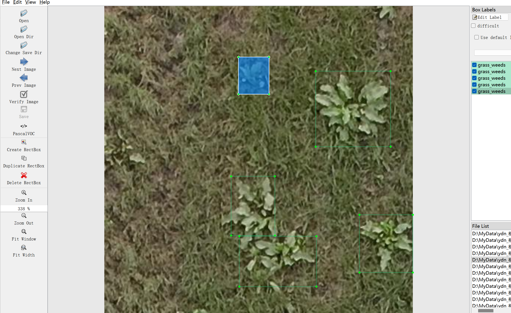

# Field Weeds Detection Dataset

Introduction to the dataset: The dataset consists of 2484 images and corresponding annotation files.
Annotation files are provided in two formats, including VOC-formatted XML files and YOLO-formatted txt files.
There are several types of objects to be detected:
['weeds']
The number of bounding box information is as follows: (When marking, English labels are generally used, and the Chinese names provided in parentheses are for reference)
weed: 6814 (Wild grass)
Note: In one image, multiple objects may be marked, so the total number of bounding boxes may be greater than the number of images.
The complete dataset consists of three folders and one txt file:
all_images folder: Stores the dataset's images, screenshots included:
Image size information:
all_txt folder and classes.txt: Stores the YOLO-formatted txt annotation files, in the same quantity as the images, each annotation file corresponds to an individual image.
classes.txt:
For a detailed understanding of the standard YOLO file, please search on your own. Simply put, the number 0 represents the name at the position 0 in the array in classes.txt.
all_xml folder: VOC-formatted XML annotation files.
In the same quantity as the images, each annotation file corresponds to an individual image.
For a detailed understanding of the VOC format standard file, please search on your own.
Both formats of annotation can be used, choose one according to your preference.
Annotation effect screenshot:

## Images

Here is a pay link on Stripe ( https://buy.stripe.com/3cs8yP7sY87d0vu9AB ). Please contact me lonlonago@foxmail.com after funding $89, and I will send you a complete data files , thank you!

